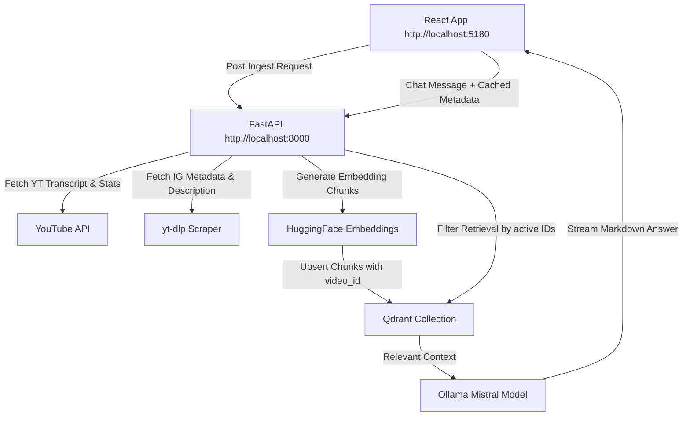

# RAG Video Analyst (Updated) 🤖🎥

An enterprise-grade, fully local Retrieval-Augmented Generation (RAG) chatbot and analysis dashboard designed to compare, analyze, and cross-examine social media content (YouTube videos & Instagram Reels) side-by-side using local AI.

Built for content creators, strategists, and marketing teams to evaluate engagement metrics, transcripts, and content patterns in real time.

---

## 🌟 Key Features

1. **Dual Platform Ingestion:** Scrapes and processes YouTube transcripts & statistics (via YouTube Data API) and Instagram Reels metadata & descriptions (via resilient `yt-dlp` scraping) side-by-side.
2. **Local AI & Embeddings Pipeline:** Run everything completely free and locally! Uses **Ollama (Mistral)** for generative chat, **HuggingFace (BAAI/bge-base-en-v1.5)** for sentence embeddings, and **Qdrant** as the local vector storage database.
3. **Resilient Demo Safeguards:**
   - **Frontend Metrics Editor:** Adjust creator name, views, likes, comments, duration, subscribers/followers, and following counts directly on-screen with instant engagement rate recalculations.
   - **Auto-Estimation Safeguard:** Intercepts `0 views` (when creator metrics are hidden/restricted) and automatically estimates views as $Likes \times 7.5$ so the chatbot remains flawless.
4. **Smart Session Filtering:** Filters Qdrant similarity searches specifically to the active loaded videos. Older sessions do not contaminate your current comparative analysis, ensuring 100% accurate responses.
5. **Polished Stream-Chat Experience:** A premium glassmorphism dark-mode UI with streaming AI responses. Your typed questions remain visible while the AI streams, and all unnecessary citation logs are hidden for a clean production feel.

---

## 🏗️ System Architecture



---

## 🛠️ Tech Stack

* **Frontend:** React, Vite, Vanilla CSS (Premium glassmorphism dark mode with micro-animations)
* **Backend:** FastAPI, Pydantic, Uvicorn
* **Orchestration:** LangGraph (v0.2.16) StateGraph workflow
* **Vector DB:** Qdrant DB
* **Embeddings Model:** `BAAI/bge-base-en-v1.5` (via LangChain HuggingFace)
* **LLM Engine:** Ollama (`mistral` model)

---

## 🚀 Getting Started

### Prerequisites

1. **Python 3.10+** (recommended)
2. **Node.js 18+**
3. **Ollama:** [Download Ollama](https://ollama.com/) and run the Mistral model:
   ```bash
   ollama pull mistral
   ```
4. **Qdrant DB:** Run Qdrant locally in Docker:
   ```bash
   docker run -p 6333:6333 qdrant/qdrant
   ```
   *(Alternatively, run it via the docker-compose file in this repository).*

---

### Installation & Setup

#### 1. Clone & Configure Environment
Create a `.env` file in the root directory:
```env
YOUTUBE_API_KEY="your_youtube_data_api_v3_key"
QDRANT_URL="http://localhost:6333"
OLLAMA_API_URL="http://localhost:11434"
OLLAMA_MODEL="mistral"
EMBEDDINGS_MODEL="BAAI/bge-base-en-v1.5"
EMBEDDINGS_DEVICE="cpu"
```

#### 2. Setup Backend (Python Environment)
```bash
# Create virtual environment
python -m venv .venv

# Activate virtual environment
# On Windows:
.venv\Scripts\activate
# On Linux/macOS:
source .venv/bin/activate

# Install requirements
pip install -r requirements.txt
```

#### 3. Setup Frontend (React / Vite)
```bash
# Install dependencies
npm install
```

---

### Running the Application

1. **Start Qdrant & Ollama** (Make sure Docker and Ollama serve are running).
2. **Launch the Backend Server:**
   ```bash
   .venv\Scripts\python.exe backend.py
   ```
   The API will run on `http://localhost:8000`.
3. **Launch the Frontend Dev Server:**
   ```bash
   npm run dev
   ```
   Open your browser at **`http://localhost:5180`** to access the dashboard.

---

## 🎮 Mock fallbacks & Demo Preparation

If Instagram's Akamai/Imperva firewalls aggressively block your automated scraping script during a live demo, the system automatically intercepts it:
1. A warning banner appears: `⚠️ Rate-limited/Blocked. Fallback data loaded.`
2. Beautiful mock data is loaded so the application doesn't crash.
3. Click **`✏️ Edit Metrics`** inside the card.
4. Input the real views, likes, comments, and creator follower metrics in 5 seconds.
5. Click **"Save Metrics"**. The card dynamically recalculates the exact engagement rates and sends them to the Ollama model!
6. Ask: *"Compare the views and followers of the two videos."* The AI will answer instantly and correctly based on your custom edited values.
